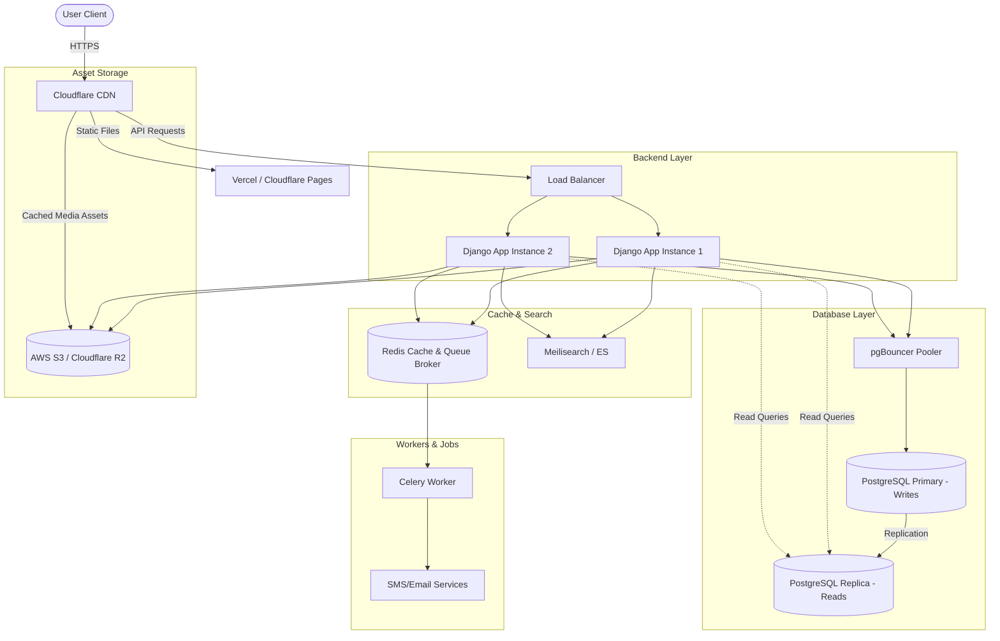

# Krishi-Wala: Deployment & System Design Scaling Plan

This document outlines the system architecture, deployment strategy, and scaling roadmap for **Krishi-Wala**—a two-sided agricultural marketplace where users can rent land, hire labor, and rent farming machinery. 

---

## 1. Technical Stack Analysis & Prerequisites

Before deploying, we must analyze the current development stack and identify changes needed for a production environment.

### Current Dev Architecture
*   **Frontend**: React (v19), Vite, Tailwind CSS (v4), Axios.
*   **Backend**: Django (v5.1), Django Rest Framework (DRF), custom JWT authentication (`PyJWT` HS256).
*   **Database**: SQLite (`db.sqlite3` file).
*   **File Storage**: Local directory (`/media/` for land photos, machine photos, and labor avatars).

### Production Prerequisites (Required for any scale)
1.  **Database Migration**: SQLite is a file-based database that locks the database during writes. It is **unsuitable for production** due to concurrency limitations. We must migrate to **PostgreSQL**.
2.  **Stateless Backend**: Currently, media files are stored locally in the Django container. If the container restarts or autoscales, these files are lost. We must decouple storage by moving media and static files to an Object Storage service like **Amazon S3**, **Cloudflare R2**, or **DigitalOcean Spaces** using `django-storages`.
3.  **Environment Variables**: Remove hardcoded configurations (like `SECRET_KEY = "Abhishek4852"` in `authentication/views.py` and database credentials) and load them from environment variables.

---

## 2. Server vs. Serverless: The Deployment Verdict

When an interviewer asks: *"Why did you choose Server (VM/Containers) over Serverless (FaaS) for this project?"*, here is the structured comparison and decision:

### Comparison Matrix

| Criteria | Serverless (FaaS - AWS Lambda) | Containerized Server (Render, ECS, GCP Cloud Run) |
| :--- | :--- | :--- |
| **Cold Starts** | High. Django takes ~1-2 seconds to boot and load all models, leading to slow response times for initial requests. | Minimal. Containers stay warm and serve requests instantly. |
| **State & Files** | Ephemeral. Local media uploads will fail completely without external S3 integrations. | Persistent options exist, though S3 is still best practice. |
| **DB Connections** | Ephemeral. Each Lambda function opens a new database connection, easily exhausting database connection limits. | Persistent connection pooling can be maintained directly in the application or via pgBouncer. |
| **Background Tasks** | Hard. Difficult to run asynchronous workers (like Celery/Redis) for notifications. | Easy. Can run worker processes alongside web processes. |
| **Cost Profile** | Pay-per-use. $0 if no traffic, but scales up linearly with high traffic. | Fixed base cost. Scales horizontally with traffic. |

### The Verdict: Containerized Server / PaaS (Recommended)
For the **Krishi-Wala backend**, we choose a **Containerized Server model (e.g., AWS App Runner, ECS, Render, or GCP Cloud Run)** rather than Serverless FaaS (AWS Lambda). 
*   **Why?** Django is a monolithic framework. Booting the entire framework, loading model classes, establishing database connections, and managing CORS middleware on every cold start is highly inefficient. 
*   **For the Frontend**: A **Serverless/Static Hosting** approach (Vercel, Netlify, or Cloudflare Pages) is chosen. Since the Vite build produces static HTML, CSS, and JS, serving them from a CDN edge is cheap, fast, and infinitely scalable.

---

## 3. Scaling Roadmap: 100 to 5,000 Users

Here is how we scale Krishi-Wala incrementally, detailing the components, system design patterns, and why we add them.



---

### Phase 1: Launch & Handling ~100 Active Users (The MVP)
At this stage, the load is low. The priority is reliability, database integrity, and cost-efficiency.

#### Architecture
*   **Hosting**: Render (Web Service) or AWS App Runner for backend, Vercel/Netlify for frontend.
*   **Database**: Managed PostgreSQL (e.g., Render Postgres, Neon, or AWS RDS Postgres) - Basic tier.
*   **File Storage**: AWS S3/Cloudflare R2 + `django-storages` library.

#### Key Additions & System Design Concepts
1.  **Managed Database**: Replaced SQLite with PostgreSQL. This enables ACID transactions, concurrent writes, and prevents locking database files when multiple users register or book machines simultaneously.
2.  **Asset Decoupling**: Media uploads are streamed directly to S3. This ensures the Django application instance is completely **stateless**, allowing us to restart or scale the server without deleting users' land or machine images.
3.  **In-Memory Caching (Basic)**: 
    *   *What to add*: Redis (basic instance).
    *   *Where to use*: Cache the standard land, labor, and machine lists. These lists do not change every second. Instead of querying the database on every page load, we cache the serialized lists in Redis for 5 minutes.
    *   *Code Impact*: Use Django’s built-in `@method_decorator(cache_page(60*5))` on list views.

---

### Phase 2: Growing to ~500 Active Users (The Concurrency Phase)
At 500 active users, concurrent database read requests will spike, and long-running operations (like sending booking emails/SMS) will block request threads, leading to timeouts.

#### Architecture
*   **Hosting**: Horizontal scaling. Run 2-3 instances of the Dockerized Django container behind a **Load Balancer** (Render Load Balancer or AWS ALB).
*   **Database**: PostgreSQL with **Connection Pooling**.
*   **Caching**: Redis (shared cluster/instance).
*   **Asynchronous Tasks**: **Celery** + **Redis** (as message broker).

#### Key Additions & System Design Concepts
1.  **Horizontal Autoscaling**: The Load Balancer distributes requests round-robin across multiple Django container instances. If one instance crashes, the system remains available (High Availability).
2.  **Database Connection Pooling (PgBouncer)**:
    *   *Problem*: Django creates a new database connection for every request and closes it at the end. At 500 users, Postgres will run out of connection handles (`max_connections` limit reached), throwing "Too many connections" errors.
    *   *Solution*: Place PgBouncer between Django and PostgreSQL. PgBouncer keeps a pool of warm database connections and multiplexes them, reducing database handshake overhead.
3.  **Asynchronous Task Queue (Celery + Redis)**:
    *   *Problem*: When a farmer requests a machine, the backend sends an email or SMS notification to the owner. Network calls to SMS providers (like Twilio) can take 1-3 seconds. If done synchronously in the request-response cycle, the user's browser hangs, and system throughput plummets.
    *   *Solution*: Offload notifications to a background worker. Django pushes a task (e.g., `send_notification_task`) to a Redis queue. A Celery worker processes this task asynchronously in the background. The API returns a `202 Accepted` response instantly, keeping the UX snappy.
4.  **Session and JWT Blacklisting Cache**: Use Redis to store invalid or blacklisted JWT tokens (e.g., when a user logs out). Since Redis is in-memory, checking token validity takes sub-milliseconds.

---

### Phase 3: Scaling to 5,000+ Active Users (The Production-Grade Marketplace)
At 5,000 active users, the main database will become a bottleneck due to complex search queries and heavy write volumes (booking requests, listings). Full-table scans will degrade performance.

#### Architecture
*   **Hosting**: AWS ECS (Fargate) or Kubernetes (EKS) with Auto-Scaling Groups.
*   **Database**: Primary-Replica (Master-Slave) PostgreSQL setup.
*   **Search**: Dedicated Search Engine (**Meilisearch** or **Elasticsearch**).
*   **Content Delivery**: **Cloudflare** or **AWS CloudFront** CDNs.

#### Key Additions & System Design Concepts
1.  **Read-Write Splitting (Primary-Replica DB)**:
    *   *Concept*: Marketplace apps are read-heavy (90% searching, 10% booking/writing). 
    *   *Implementation*: Deploy a Primary PostgreSQL instance (for writes/bookings) and 1 or 2 Read Replicas. Django settings are configured with a custom Database Router:
        ```python
        # Database Router Concept
        class PrimaryReplicaRouter:
            def db_for_read(self, model, **hints):
                return 'replica'
            def db_for_write(self, model, **hints):
                return 'default'
        ```
    *   This removes search/read loads from the primary database, ensuring that critical writes (bookings, transactions) always succeed without delays.
2.  **Advanced Search Engine (Meilisearch or Elasticsearch)**:
    *   *Problem*: In `searching/views.py`, searches use Django’s `Q(district__icontains=query)` or `Q(machine_name__icontains=query)`. At 5,000 users, relational tables with text scans become incredibly slow.
    *   *Solution*: Synchronize the `Land`, `Labour`, and `Machine` models to a lightweight search index (Meilisearch). Meilisearch handles typo tolerance, autocomplete, geospatial coordinates (e.g., "find machinery within 10km"), and executes queries in <10ms.
3.  **Edge Caching (CDN)**:
    *   Configure Cloudflare CDN in front of S3 media storage. Images of land and machines are cached at regional edge servers globally. Users load images from a nearby Cloudflare server instead of hitting AWS S3, reducing load times and eliminating cloud egress bills.
4.  **Database Indexing**:
    *   Ensure database indexes are explicitly defined on frequently queried foreign keys and search columns:
        *   `state`, `district`, `village` (in Land, Labour, and Machine).
        *   `receiver_mobile` and `sender_mobile` (in Request tables).
5.  **Monitoring & Observability**:
    *   **APM (Application Performance Monitoring)**: Integrate **Sentry** to capture traceback errors in production.
    *   **Metrics**: Use **Prometheus & Grafana** or **Datadog** to monitor CPU, memory, database connection count, and Redis queue length.

---

## 4. Summary of Scaling Steps (Cheat Sheet for Interviews)

If asked by an interviewer: *"What is your scaling plan?"*, walk through this clear 4-step sequence:

```
[ SQLite Dev DB ] 
      │
      ▼
1. GET PRODUCTION READY (0 - 100 Users)
   ├── Migrate to PostgreSQL (Concurrent writes, ACID)
   ├── Move Media to S3/Cloudflare R2 (Stateless backend)
   └── Cache lists (Land/Machines) in Redis (Minimize DB reads)
      │
      ▼
2. SCALE CONCURRENCY (100 - 500 Users)
   ├── Add PgBouncer (Database connection pooling)
   ├── Run multiple Django instances behind a Load Balancer
   └── Offload SMS/Emails to Celery + Redis (Asynchronous workers)
      │
      ▼
3. DISTRIBUTE & OPTIMIZE (500 - 5000+ Users)
   ├── Database Read Replicas (Read/Write splitting)
   ├── Dedicated Search (Meilisearch / Elasticsearch for geo & text search)
   ├── CDN Caching (Cloudflare for images & static assets)
   └── Explicit Database Indexes on locations (district, state) and mobile keys
```
